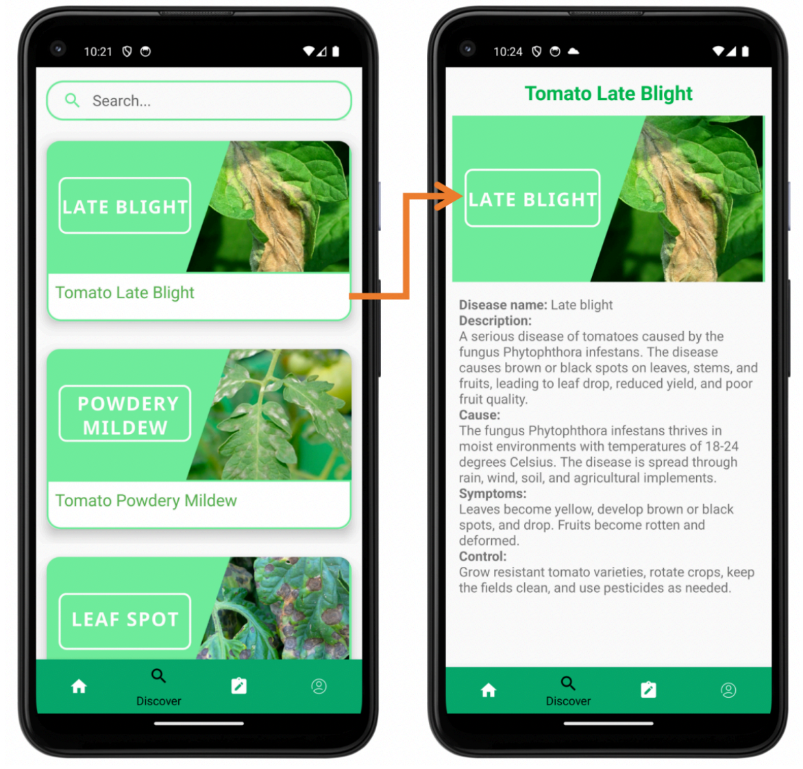

# Application to detect the tomato plant disease

- Login Page

      width="300" height="600">

- Main Page

- Profile Page 

- Detection Page

-Discover page 

## Installations and setup

- git clone `https://github.com/pheb2014939ctu/Tomato_Leaf_Disease_Detection_Application`
- `install gradle`
- `update the requied dependencies`
- `Run the app in AVD/Physical Device.`

TODO:

1. Add more features
2. Add detection for Weeds
3. Results more accurate

## Collaborators:

- https://github.com/Anand-Singh-techie
- https://github.com/indskgit
